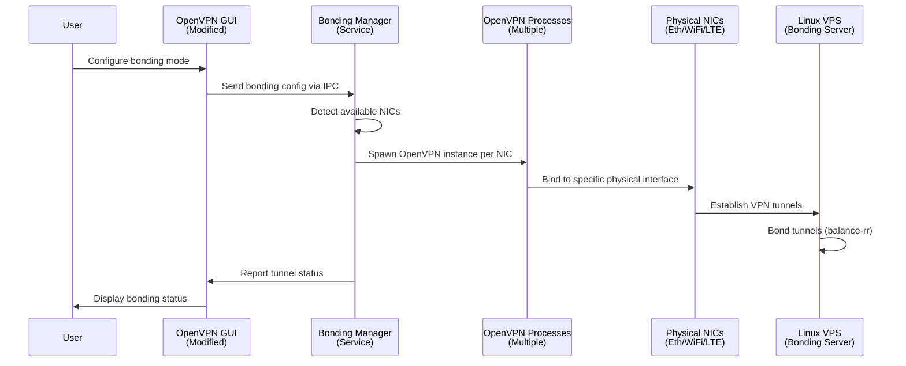

# Bonding Architecture

## System Components

The bonding system consists of several interconnected components working together to provide multi-channel VPN connectivity.

### Component Diagram



## Component Responsibilities

### OpenVPN GUI (Modified)

**Purpose**: User interface for bonding configuration and status display

**Responsibilities**:
- Display bonding configuration dialog
- Show status of all active tunnels
- Manage bonding profiles (.ovpn-bond files)
- Send configuration to bonding service via IPC
- Receive status updates from service

**Integration Points**:
- Uses existing OpenVPN GUI dialog system
- Extends profile management for bonding profiles
- Adds bonding-specific status indicators

### Bonding Manager Service

**Purpose**: Central coordinator running with admin privileges

**Responsibilities**:
- Receive bonding configuration from GUI
- Coordinate all bonding components
- Manage lifecycle of OpenVPN processes
- Handle IPC communication with GUI
- Monitor system state and handle errors

**Privileges Required**:
- Administrator (for TAP adapter creation)
- Network configuration (for routing table manipulation)

**Communication**:
- Named pipes for GUI communication
- Process management for OpenVPN instances
- Windows API for system operations

### OpenVPN Process Manager

**Purpose**: Spawns and monitors multiple OpenVPN instances

**Responsibilities**:
- Create TAP adapters for each tunnel
- Spawn OpenVPN process per physical NIC
- Bind each process to specific TAP adapter
- Monitor process health and restart on failure
- Configure routing to bind OpenVPN to physical interface

**Key Operations**:
- `CreateProcess()` for spawning OpenVPN
- TAP-Windows driver API for adapter management
- Windows routing API for interface binding
- Process monitoring and restart logic

### Packet Distributor

**Purpose**: Distributes packets across tunnels

**Responsibilities**:
- Implement round-robin distribution algorithm
- Support weighted distribution (optional)
- Handle packet ordering considerations
- Monitor tunnel health for distribution decisions

**Algorithms**:
- **Round-Robin**: Simple sequential distribution
- **Weighted**: Based on interface bandwidth or priority
- **Health-Aware**: Skip failed tunnels automatically

### NIC Detector

**Purpose**: Enumerates and monitors physical network interfaces

**Responsibilities**:
- Detect available physical NICs (Ethernet, WiFi, LTE)
- Filter out virtual adapters (TAP, loopback, etc.)
- Monitor connection status changes
- Provide NIC metadata (name, type, speed, status)

**Windows API Used**:
- `GetAdaptersInfo()` - Enumerate adapters
- `GetIfTable()` - Get interface statistics
- Network change notifications for status updates

### Configuration Parser

**Purpose**: Reads and writes bonding profiles

**Responsibilities**:
- Parse `.ovpn-bond` configuration files
- Validate configuration parameters
- Generate configuration for individual OpenVPN instances
- Save user configurations

**File Format**:
- Extended OpenVPN config format
- Additional bonding-specific parameters
- Multiple server endpoints (one per tunnel)

## Data Flow

### Configuration Flow

1. **User Configuration**:
   - User opens bonding configuration dialog in GUI
   - Selects physical NICs to use
   - Configures server endpoints (one per NIC)
   - Sets bonding parameters (mode, weights, etc.)

2. **Configuration Transmission**:
   - GUI serializes configuration
   - Sends to bonding service via named pipe
   - Service validates and stores configuration

3. **Initialization**:
   - Service detects available NICs
   - Creates TAP adapters (one per NIC)
   - Generates OpenVPN configs for each instance
   - Spawns OpenVPN processes

### Runtime Data Flow

1. **Packet Distribution**:
   - Application sends packet to virtual TAP interface
   - Packet distributor intercepts packet
   - Selects target tunnel using distribution algorithm
   - Routes packet to appropriate OpenVPN process
   - OpenVPN encrypts and sends via physical NIC

2. **Incoming Traffic**:
   - Server distributes packets across tunnels (balance-rr)
   - Each OpenVPN process receives on its physical NIC
   - Decrypts and forwards to TAP adapter
   - Packets reassembled at application level

3. **Status Updates**:
   - Each OpenVPN process reports status
   - Bonding manager aggregates status
   - Sends updates to GUI via IPC
   - GUI displays tunnel status to user

## Windows-Specific Considerations

### Multiple TAP Adapters

**Challenge**: Each OpenVPN instance needs its own TAP adapter

**Solution**:
- Use TAP-Windows driver API to create multiple adapters
- Programmatically run `addtap.bat` or use driver API directly
- Assign unique names: `TAP-Bonding-0`, `TAP-Bonding-1`, etc.
- Configure each adapter with distinct IP ranges

### Routing Table Manipulation

**Challenge**: Bind OpenVPN traffic to specific physical interface

**Solution**:
- Use Windows routing API (`CreateIpForwardEntry`, `DeleteIpForwardEntry`)
- Create routes that force traffic through specific NIC
- Use source-based routing for outbound traffic
- Monitor routing table changes and restore if modified

### Windows Service

**Challenge**: TAP adapter creation and routing require admin privileges

**Solution**:
- Implement bonding manager as Windows service
- Service runs with SYSTEM or admin privileges
- GUI runs as normal user, communicates via IPC
- Named pipes for secure communication

### Process Management

**Challenge**: Monitor and manage multiple OpenVPN processes

**Solution**:
- Use `CreateProcess()` with proper security attributes
- Monitor processes using `WaitForMultipleObjects()`
- Handle process termination and restart automatically
- Log all process events for debugging

## Server-Side Configuration

### Multiple OpenVPN Server Instances

**Setup**:
- Run multiple OpenVPN server instances on different ports
- Example: 1194, 1195, 1196 for three tunnels
- Each instance uses separate TUN interface (tun0, tun1, tun2)
- Same certificate authority for all instances

### Linux Bonding Driver

**Configuration**:
- Create bond interface: `modprobe bonding`
- Configure bond mode: `mode=0` (balance-rr, round-robin)
- Add tunnel interfaces: `ifenslave bond0 tun0 tun1 tun2`
- Assign IP to bond: `ifconfig bond0 10.8.0.1/24`

**Bonding Modes**:
- **Mode 0 (balance-rr)**: Round-robin packet distribution (recommended)
- **Mode 1 (active-backup)**: Active/standby redundancy
- **Mode 4 (802.3ad)**: LACP aggregation (requires switch support)

### Packet Reordering

**Challenge**: Round-robin can cause packet reordering

**Solution**:
- Use Linux `tc` (traffic control) for buffering
- Implement custom reordering buffer module
- Accept minor reordering for higher throughput
- Use TCP sequence numbers for application-level reordering

### Example Server Configuration

```bash
# /etc/openvpn/server1.conf
port 1194
dev tun0
...

# /etc/openvpn/server2.conf
port 1195
dev tun1
...

# /etc/openvpn/server3.conf
port 1196
dev tun2
...

# Bonding configuration
modprobe bonding
echo "bond0" > /sys/class/net/bond0/bonding/mode
echo "0" > /sys/class/net/bond0/bonding/mode
ifenslave bond0 tun0 tun1 tun2
ifconfig bond0 10.8.0.1 netmask 255.255.255.0 up
```

## Security Considerations

### Privilege Separation

- GUI runs as normal user (no admin required for users)
- Service runs with elevated privileges (only for system operations)
- IPC communication is secured (named pipes with ACLs)

### Certificate Management

- Each tunnel uses same CA but different certificates
- Or use same certificate for all tunnels (simpler)
- Server validates all client certificates

### Network Isolation

- Each tunnel is independent (can fail without affecting others)
- Routing ensures traffic goes through correct physical interface
- No cross-contamination between tunnels

## Performance Considerations

### Packet Distribution Overhead

- Minimal overhead for round-robin selection
- Weighted distribution requires more computation
- Health-aware distribution needs status monitoring

### TAP Adapter Performance

- Each TAP adapter has independent performance characteristics
- Multiple adapters may increase system resource usage
- Monitor adapter performance and adjust accordingly

### Server-Side Bonding

- Linux bonding driver is highly optimized
- Balance-rr mode has minimal overhead
- Packet reordering buffer may add latency

## Error Handling

### Process Failures

- Monitor all OpenVPN processes
- Restart failed processes automatically
- Notify user of persistent failures
- Continue operating with remaining tunnels

### NIC Failures

- Detect NIC disconnection
- Pause affected tunnel
- Attempt to resume when NIC reconnects
- Redistribute traffic to remaining tunnels

### Service Failures

- Service should be resilient to errors
- Log all errors for debugging
- Graceful degradation (continue with available tunnels)
- Automatic recovery when possible
